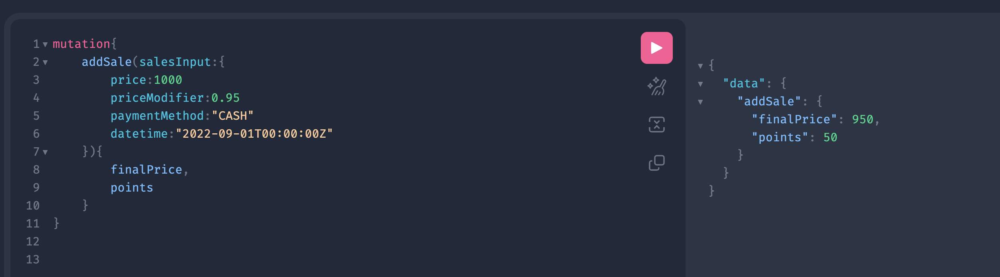
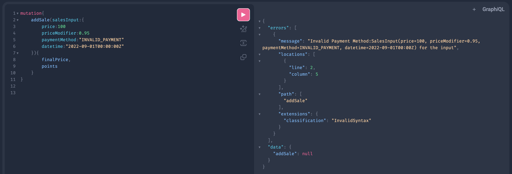
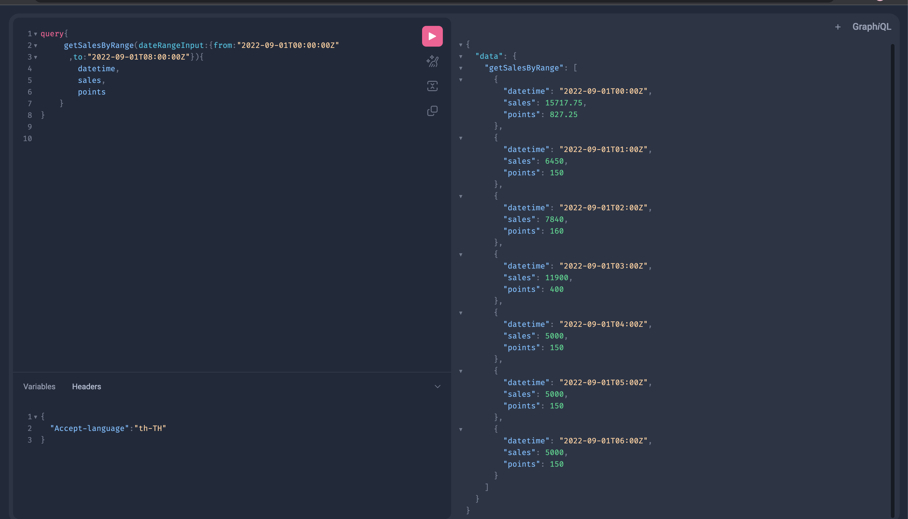

## SUMMARY

Assigment Project for Anymind group.
[Assignment Details](src/main/resources/assignment-statement.pdf)

## Technologies Used

| Sr.No. | Library         | Version Number | Description                                                                                                                                                                                                                                                                                                                |
|--------|-----------------|----------------|----------------------------------------------------------------------------------------------------------------------------------------------------------------------------------------------------------------------------------------------------------------------------------------------------------------------------|
| 1      | Java            | 17             | Latest LTS version of Java                                                                                                                                                                                                                                                                                              |
| 2      | Spring Boot     | 3.0.2          | I've enabled actuator just to simulate the prod environment wherein the Quorom will call /actuator/health to check whether the particular pod is active or not. We also use /actuator/refresh to refresh configuration on the fly. I haven't added spring cloud config and profiling to this project due to time constaint |
| 3      | Spring Webflux  | 6.0.4          | Non-Blocking Reactive Web Spring Framwork                                                                                                                                                                                                                                                                                  |
| 4      | GraphQL         | 19.2           | With GraphQL, clients can specify exactly what data they need, reducing over-fetching and under-fetching of data, and making it easier to build and maintain APIs.I've used Mutation ,Query and a Graphql-Scaler Library for this project to use ZonedDateTime and BigDecimal datatypes for Graphql                        |
| 5      | Lombok          | 1.18.26        | Annotation Pre-processor                                                                                                                                                                                                                                                                                                   |
| 6      | Spring R2DBC    | 3.0.1          | Non-Blocking JPA Implementation                                                                                                                                                                                                                                                                                            |
| 7      | PostgresSQL     | 15.2           | DB, it gives issue with timestamp format, so I've used a PostGresql specific timestamz format.                                                                                                                                                                                                                             |
| 8      | R2DBC Pool      | 1.0.0          | For Connection Pooling                                                                                                                                                                                                                                                                                                     |
| 9      | LogBack         | 1.4.5          | Default logging lib, Configured RollingFile Appender like the one we have on production                                                                                                                                                                                                                                    |
| 10     | Netty           | 4.1.87         | Non-Blocking webserver                                                                                                                                                                                                                                                                                                     |
| 11     | Junit 5/Mockito | 4.8.1          | For Unit and Integration Tests                                                                                                                                                                                                                                                                                             |
| 12     | Docker          | 4.16.2         | Used for containerization                                                                                                                                                                                                                                                                                                  |
| 13     | Docker-Compose  | 4.16.2         | Use for multi-container environment of postgresql and mysql                                                                                                                                                                                                                                                                |

## STEPS FOR RUNNING POINTS-CALCULATOR LOCALLY

### BUILD the application

`./gradlew build`

### BUILD AND UP Docker Compose

> Make sure you have docker and docker-compose running.

`docker-compose up --build`

`docker-compose down` # down docker compose

## Access GraphqiQL UI On

http://localhost:8080/graphiql?path=/graphql

## CURLS

#### 1.POST /graphql -ADD SALE DATA



#### QUERY

```graphql
mutation{
    addSale(salesInput:{
        price:100
        priceModifier:0.95
        paymentMethod:"CASH"
        datetime:"2022-09-01T00:00:00Z"
    }){
        finalPrice,
        points
    }
}
```

```
curl --location --request POST 'http://localhost:8080/graphql' \
--header 'Content-Type: application/json' \
--data-raw '{"query":"mutation{\n addSale(salesInput:{\n price:100\n priceModifier:0.95\n paymentMethod:\"CASH\"\n
datetime:\"2022-09-01T00:00:00Z\"\n }){\n finalPrice,\n points\n }\n}\n\n","variables":{}}'
```

#### 2.POST /graphql -ADD SALE DATA-INVALID PAYMENT METHOD



> Passed an Invalid Payment method, and it returns the appropriate error response

#### QUERY

```graphql
mutation{
    addSale(salesInput:{
        price:100
        priceModifier:0.95
        paymentMethod:"INVALID_CASH"
        datetime:"2022-09-01T00:00:00Z"
    }){
        finalPrice,
        points
    }
}
```

#### CURL

```
curl --location --request POST 'http://localhost:8080/graphql' \
--header 'Content-Type: application/json' \
--data-raw '{"query":"mutation{\n addSale(salesInput:{\n price:100\n priceModifier:0.95\n paymentMethod:\"INVALID_CASH\"\n
datetime:\"2022-09-01T00:00:00Z\"\n }){\n finalPrice,\n points\n }\n}\n\n","variables":{}}'
```

#### 3.POST /graphql -ADD SALE DATA-INVALID PRICE MODIFIER


> Passed an Invalid Price Modifier,which we validate as per the given specs-Values stored in DB, and it returns the
> appropriate error.

#### QUERY

```graphql
mutation{
    addSale(salesInput:{
        price:100
        priceModifier:0.1
        paymentMethod:"CASH"
        datetime:"2022-09-01T00:00:00Z"
    }){
        finalPrice,
        points
    }
}
```

#### CURL

```
curl --location --request POST 'http://localhost:8080/graphql' \
--header 'Content-Type: application/json' \
--data-raw '{"query":"mutation{\n    addSale(salesInput:{\n        price:100\n        priceModifier:0.1\n        paymentMethod:\"CASH\"\n        datetime:\"2022-09-01T00:00:00Z\"\n    }){\n        finalPrice,\n        points\n    }\n}\n\n","variables":{}}'
```

#### 4. POST /graphql -GET POINTS AGGREGATED SALE AND POINTS REPORT SPLIT BY AN HOUR



> Here we're getting the data for from:"2022-09-01T00:00:00Z"
> to:"2022-09-01T08:00:00Z", so it will call the DB, will gather all the data from the DB
> and will split the data by and hour and add all the sale and points for that given hour.

[DB DATA USED FOR GENERATING RESPONSE OF THIS HOURLY DATA](src/main/resources/evidences/data.csv)

#### QUERY

```graphql
query{
    getSalesByRange(dateRangeInput:{from:"2022-09-01T00:00:00Z"
        ,to:"2022-09-01T08:00:00Z"}){
        datetime,
        sales,
        points
    }
}
```

#### CURL

```
curl --location --request POST 'http://localhost:8080/graphql' \
--header 'Content-Type: application/json' \
--data-raw '{"query":"query{\n     getSalesByRange(dateRangeInput:{from:\"2022-09-01T00:00:00Z\"\n      ,to:\"2022-09-01T08:00:00Z\"}){\n        datetime,\n        sales,\n        points\n    }\n}\n\n","variables":{}}'
```

### [WIP] Pending To-do

- Deploy on AWS
- Create Jenkins Pipeline
- Increase testing coverage further for integration test

### [WIP]Further explanation

> Explanation about my thought process on how to scale up and implement CI/CD practices

[FURTHER-EXPLANATION](https://docs.google.com/document/d/1rS9j7QywFyHuTvuJ05mR4LUp-yMJBOmz1aVNNhAw65w/edit)
